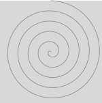
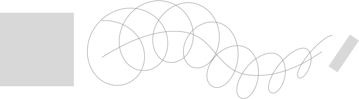
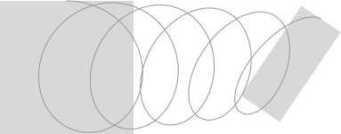

# ddSpiral
Make almost any kind of spiral appear magically in Sketch [Sketch](https:www.sketch.com).

## TODO's
- check - sent all data to webview and back (location info and target.id)
- check - Create spiral
- check - Plugin setting
- check - var theme = UI.getTheme();if (theme === 'dark') {} else {}
- check - Make rotation work correctly
- check - Store spiral path
- check - Clear stored path on new selection
- check - Make exception for 2 object spiral -> draw in document instead of parent
- check - Add buymeacoffee
- Add squeeze (force) option (see below)
- Update github
- Create logo
- Create examples
- Publish

## Dependencies
This is a plugin for Sketch, so you need [Sketch](https://www.sketch.com). No other tool needed.

ddSpiral was created with Sketch Plugin Manager, so if you are planning to use the source code you'll probably need [SKPM](https://github.com/skpm/skpm) too. Together with [sketch-module-web-view](https://github.com/skpm/sketch-module-web-view/tree/master/docs).

## Installation
Download and double-click the plugin. Or drop it on the Sketch app. 

## What it does
You can make almost any spiral you want. Just select up to 2 objects and/or an open path and run ddSpiral from the plugin menu. The plugin presents you with an overlay for adjustments. You can update the spiral as long as you stay in the overlay.

## How it works
You can select up to 2 objects and an open path. The spiral will behave slightly differently accordingly. In every case, you can change:
- direction (clockwise or counterclockwise),
- number of revelutions (loops),
- number of points per loop (tangents),
- transition (linear, ease, ease-in or ease-out),
- and smoothness (0=sharp corners, 100=perfect curves, >100=experimental).

The size and rotation of both start and finish is determined by the selected object(s), but these number can also be changed.

### 1. Select a single object, such as an image, group, or symbol, and then run ddSpiral
If you select a single object, not a path, the spiral rotates from the bounding box to the center of the object. Position, size and rotation are inherited from the selected object. The spiral is drawn on top of the object in the same group.

### 2. Select a closed shape, like a rectangle, oval or any other custom closed path, and then run ddSpiral
Selecting a single closed path is basically the same as #1 but the experimental option 'Force into shape' becomes available. When checked, the spiral extends from top to bottom, roughly staying within the object's outer perimeter rather than inside the bounding box. If you need a forced spiral in a different direction within the closed shape, you must first rotate your selected object and then flatten the shape before running ddSpiral, for now.

### 3. Select an open path, i.e. a line, and then run ddSpiral
Choosing an open path and the spiral will stretch along the line. By optionally selecting 1 or 2 other shapes or objects along with the open path, the size and rotation of these objects will be used as a preset. The option 'Mirror around midpoint' swaps the end point and half way point, creating a symmetrical spiral.

### 4. Select two shapes or objects, and then run ddSpiral
The spiral is stretched from the first object to the second, using their coordinates, size and rotation. The first object is the object behind all others, not necessarily the first selected object. The spiral is drawn at the document level if both objects belong to a different group.

## Additional features
- Darkmode is supported
- You can leave the overlay open. It floats in anticipation of a new selection.
- The plugin won't respond to event form Sketch while inactive (closed overlay).
- Check the option 'Auto update' and you don't have to click the 'Update' button anymore.

## Wishlist
- Store options like 'Auto update' in a setting
- Logarithmic scale for transition options.
- Some visual info button to this readme file.
- Rotating version of the forced spiral.
- Clean option to remove the preselected objects automatically (really?).
- Update notice for new versions or other information.

## Known issue
There is a known side effect that you can resolve yourself. Paths are made with bézier curves. The smoothness depends on the length of the path, in combination with the number of loops as well as the number of points per loop. If the combination doesn't match you can get unexpected turns and bends. Especially if the route along an open path contains long or sharp turns. Try changing the path, number of loops or points for a better result. If you set the number of points very high, which you should not do of course, then you can see how the curve should actually run. Manually updating the tangents afterwards is also always an option.

## Do you have any ideas or improvements?
The plugin should be bug free. If you find one, please let me know!

## Free
This plugin is free. You can use it as long as the Sketch API remains unchanged and you can also use the code to develop your own plugin. The code is not minified with lot's of comments. It was written with the best of knowledge. ddSpiral was my first plugin and the Sketch API documentation is, well, as good as it gets: important bits and pieces are missing, the examples that exist online are mostly outdated and the forum has recently been abandoned. Fortunately, there are quite a few well-written example plugins around that you can learn from also.

If you like it you may also consider [buying me a coffee](https://www.buymeacoffee.com/Mastermek).

Have fun and thanks.
Mek
