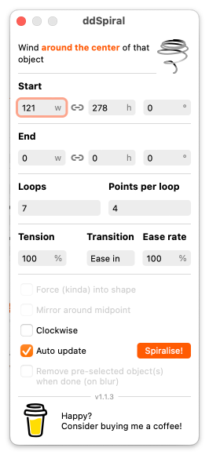
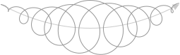
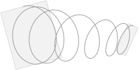

# ddSpiral
Make almost any kind of spiral appear magically in [Sketch.](https:www.sketch.com)

## Dependencies
ddSpiral is a plugin for Sketch, so you just need [Sketch.](https://www.sketch.com)

The plugin was created with Sketch Plugin Manager, so if you are planning to use the source code you'll probably need [SKPM](https://github.com/skpm/skpm) too. Together with [sketch-module-web-view](https://github.com/skpm/sketch-module-web-view/tree/master/docs) as a bridge between the plugin and the overlay for user input.

## Installation
Download and double-click the [latest version.](https://github.com/Design-Dude/ddSpiral/releases/latest) Or drop it on the Sketch app icon. 

## How it works
Just select up to 2 objects and/or an open path and run 🌀 ddSpiral from 🧰 ddTools in the plugin menu. You can also hit CTRL-ALT-SHIFT-S (All future ddTools wil use CTRL-ALT-SHIFT). The plugin presents you with an overlay for adjustments. The spiral will behave slightly differently depending on the selected objects. As long as you stay in the overlay you can update the spiral by altering:
- size and rotation (preset by the selected objects)
- direction (clockwise or counterclockwise),
- number of revolutions (loops),
- number of points per loop (tangents),
- curve (0%=sharp corners, 100%=optimal curves, >100%=experimental).
- transition (linear, ease in and out, ease-in or ease-out),
- and (easing) velocity (0%=same as linear, 30%=smooth, 100%=exponetial).

### 1. Select a single object, such as an image, group, or symbol, and then run ddSpiral
If you select 1 object, not a path, the spiral rotates from the bounding box to the center of the object. Position, size and rotation are inherited from the selected object. The spiral is drawn on top of the object in the same group.

### 2. Select a closed shape, like a rectangle, oval or any other custom closed path, and then run ddSpiral
Selecting a closed path is basically the same as #1 but the experimental option 'Force into shape' becomes available. When checked, the spiral runs from top to bottom, roughly staying within the object's outer perimeter rather than inside the bounding box.

### 3. Select an open path, i.e. a line, and then run ddSpiral
Choose an open path and the spiral will stretch along the route of the selected line. By optionally selecting 1 or 2 other shapes/objects along with the open path, the size and rotation of these objects will be used as a preset. The option 'Mirror around midpoint' swaps the end point and half way point, creating a symmetrical spiral.

### 4. Select two shapes or objects, and then run ddSpiral
The spiral is stretched from the first object to the second, using their coordinates, size and rotation. The first object is the object behind all others, not necessarily the first selected object. The spiral is drawn at the document level if both objects belong to a different group.

## Additional features
- Automatic update option (you can also press RETURN for a quick update).
- Little overhead, the plugin does not respond to events from Sketch as long as the overlay is closed.
- You can leave the overlay open and make a new selection for another spiral or make a new spiral on the same selection.
- Adjustable logarithmic scale for transition options.
- User input is saved for the next spiral.
- Thoughtful user experience in a pleasant user interface.
- Dark mode support.

## Whislist for future versions
- Rename revolutions to loops.
- Rename curve to tension and possibly change scale to -1 / 0 / 1+ instead of %.
- Rename velocity to rate or speed (of change) and change scale to 0 / 1 / 1+ instead of %.
- Option to clear the preselected objects at blur.
- Spinning option for real arti results.
- Rotating version of the forced spiral.

## Privacy
ddPlugin will ping the ddServer for updates upon activation. No data is sent to the server. By using the plugin, you automatically agree to this fait accompli (or you can strip the functionality and build your own version of the plugin).

## Known issues
1. There seems to be a slight calculation error with rotating spirals (more than 180°) against there natural direction. We're on it.

2. There is a known side effect that you can sometimes resolve yourself. Paths are made with bézier curves. The smoothness depends on the length of the path, in combination with the number of loops as well as the number of points per loop. If the combination doesn't match you can get unexpected turns and bends. Especially if the route along an open path contains long or sharp turns. Try changing the path, number of loops or points for a better result. If you set the number of points very high you can see how the curve should actually run. However, many points is completely unnecessary. 4 tangents is more than enough in most cases. Manually removing and adjusting the tangents afterwards is also always an option.

3. The 'Force into shape' option is a work in progress.
- Logically, this option also suffers from the sharp corners and varying radii described above. ddSpiral is not very good in tight spaces, especially at the beginning and end where the direction is indeterminate. Subsequent adjustments are often necessary. Keep it simple is the motto.
- The spiral is never interrupted, so no gaps or notches are taken into account.
- For now, the spiral will only run from top to bottom, not in any other direction. You can of course rotate your object before running ddSpiral.
- Filling large objects with ddSpiral can take some time because the perimeter must first be meticulously unraveled in its entirety. Turn off auto update if that is the case.

## On the drawing board
- Smooth hand-drawn paths.
- Turn lines into pencil drawing
- Decorating paths and repeating object in various patterns.
- Unit calculator (there is a plugin for that, perhaps it's good enough).

## Do you have any ideas or improvements?
Please [contact](https://github.com/Design-Dude/ddSpiral/discussions) me if you have any other advice or creative idea. Also, ddSpiral is hopefully bug free. If you find one, [please let me know! ](https://github.com/Design-Dude/ddSpiral/issues)

## Have fun
You can use it as long as the Sketch API remains unchanged and you can also use the source code with lots of comments to develop your own plugin. It was written with the best of knowledge. ddSpiral was my first plugin and the Sketch API documentation is, well, as good as it gets: important bits and pieces are missing, the examples that exist online are mostly outdated and the forum has recently been abandoned. Fortunately, there are quite a few well-written example plugins around that you can learn from also. Don't hesitate to ask your questions.

If you like it you may consider [buying me a coffee](https://www.buymeacoffee.com/Mastermek).

Thank you for using ddSpiral.

Mek

